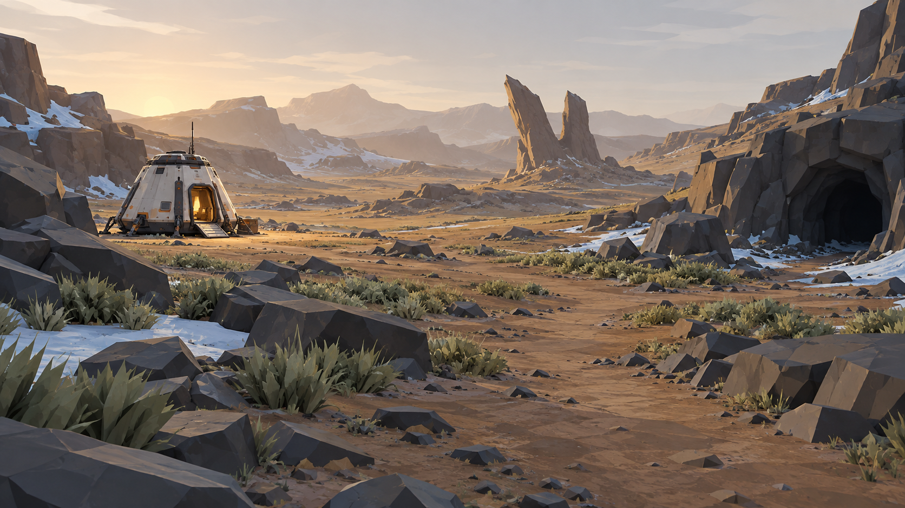
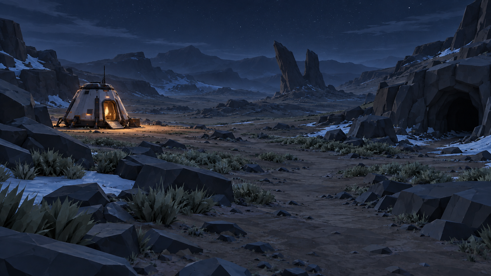
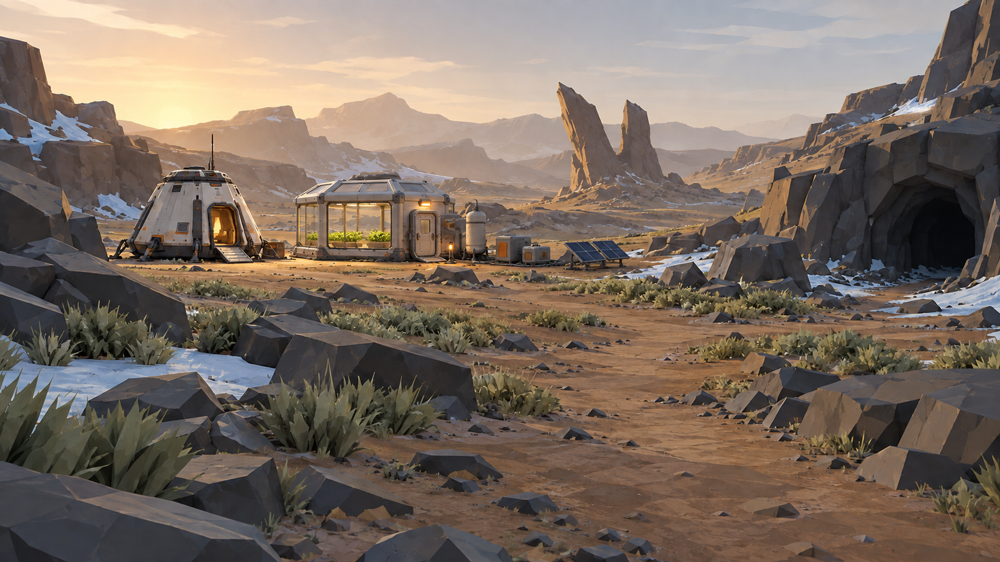
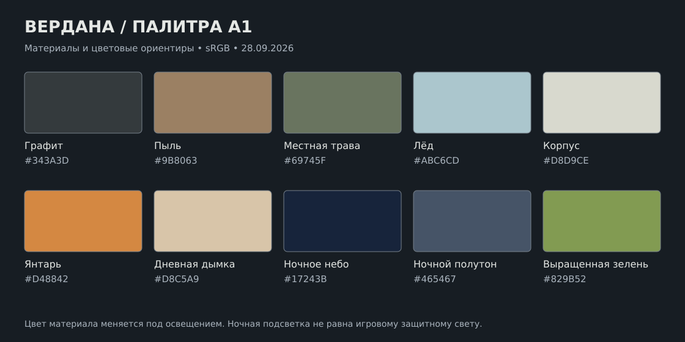

# Вердана — художественное руководство A1

**Этап 1: облик мира. 28.09.2026.** Рабочее направление принято ассистентом по поручению Малика; его можно корректировать. Основа — GDD 1.0 и [визуальный бриф](VERDANA_VISUAL_BRIEF.md). Здесь закрепляются художественные решения, без изменения рецептов, стартового набора и состава первой версии.

**Результат:** три согласованных концептуальных кадра, палитра и правила оформления. Это растровые концепты, не скриншоты приложения. Впоследствии создан [блокинг B1](../prototypes/VERDANA_B1.md) с простыми объёмами; окончательные GLB-модели и макеты UI ещё не сделаны. Детализация концептов не является обязательным бюджетом геометрии; производительность и читаемость на телефоне не измерены.

## 1. Образ планеты

**Холодная чужая долина, где игрок постепенно создаёт тёплый обжитой уголок.**

Первое впечатление: тишина, простор, слоистая порода, немного примитивной растительности. Место не мёртвое: видны трава, лёд, естественные пути между скалами. Но оно ещё не пригодно для жизни без оборудования. Посадочная капсула читается как единственное человеческое убежище.

Визуальные опоры:

1. **Крупные формы.** Раздвоенная скала, силуэт капсулы и обрамление пещеры узнаются без маркера.
2. **Холодная среда / тёплое жильё.** Серо-зелёная растительность и графитовая порода; янтарный рабочий свет возле человека.
3. **Следы работы игрока.** Ровное основание, собранные панели, аккуратные соединения и выращенная зелень показывают освоение места.

Референсы остаются выбранными в GDD: Ad Astra — понятное промышленное оборудование, The Planet Crafter — видимое изменение среды, Astroneer — крупные читаемые формы. Конкретные модели, текстуры, интерфейс и художественные ассеты этих игр не используются.

## 2. Три эталонных кадра

Кадры имеют одинаковый размер 1672×941, почти 16:9. Ночь и ранняя база получены редактированием дневного кадра с сохранением камеры и крупных ориентиров. Это композиционное соответствие, а не точный чертёж или одинаковая 3D-геометрия. Форма мелких деталей может различаться.

### A1-D — первоначальная долина днём

Капсула слева, раздвоенная скала в глубине, вход в пещеру справа. Ближние камни обрамляют открытый маршрут. Низкое солнце подчёркивает слои породы, янтарная дымка отделяет дальние планы. Трава растёт отдельными пятнами; лёд сохраняется в углублениях и возле уступов.

**Переносим в игру:** композицию, цветовые отношения, крупные силуэты и контраст материалов. **Уточняем в блокинге:** расстояния, высоты, ширину проходов и количество мелких камней. Этот эффектный ракурс не объявляется точной точкой появления игрока; игрок начинает в капсуле.

Низкое солнце — один эталон дневного света, не обещание постоянного заката. В середине игрового дня свет будет более нейтральным, с сохранением серо-зелёной основы Верданы. Полуденный вид проверяется уже на 3D-сцене.

### A1-N — та же долина ночью

Рельеф остаётся различимым в холодном рассеянном свете. На фоне неба читается раздвоенная скала; у пещеры виден вход, но глубина теряется в темноте. У капсулы небольшой тёплый световой остров. Небо со сдержанными звёздами, без новых крупных небесных тел.

**Переносим в игру:** контраст освещённого убежища и тёмного маршрута, разделение планов и читаемый передний план. Лёд и растения отражают свет, сами не светятся. Видимость слабого света нужно отдельно проверить на телефоне: это ещё не утверждённая яркость итогового рендера.

**Связь с правилами врагов:** художественная ночная подсветка и экспозиция не повышают игровой показатель защитного освещения. Ночь остаётся ночью для спавна и солнечного урона. Видимая в концепте тень от боковой скалы также не меняет правило солнечного урона GDD, где на планете проверяется открытое небо сверху.

### A1-B — тот же участок после строительства ранней базы

Рядом с исходной капсулой появился небольшой герметичный садовый модуль: окно, закрытый шлюз, видимые грядки. Снаружи — компактное оборудование жизнеобеспечения, бак и солнечные панели. Главные ориентиры и открытый маршрут сохраняются.

Это **результат будущей работы игрока**, не бесплатный стартовый комплект. Внешняя долина ещё не прошла терраформирование: там остаются лёд, сухой грунт и редкая местная трава. Насыщенная зелень сосредоточена внутри выращенных грядок.

Внешний образ «купола» делаем модульным: прямоугольные панели, тонкий каркас, скошенный наружный кожух крыши. Показанный рисунок не заменяет размеры GDD: **5×5×4 м с полезным объёмом 48 м³**, ортогональные герметичные грани и встроенный шлюз. Наклонные декоративные части не меняют воздушные клетки. Площадь купола на рисунке и число нарисованных солнечных панелей не являются расчётом планировки или доказательством достаточного питания.

## 3. Палитра

Значения — исходные цвета sRGB для материалов и художественных ориентиров. После освещения итоговый пиксель отличается; не нужно добиваться этих HEX в каждой точке изображения. Цвета не определяют температуру или химический состав среды.

| Назначение | HEX | Использование |
| --- | --- | --- |
| Графит | `#343A3D` | Скалы, каркас, тёмные крупные поверхности |
| Пыль | `#9B8063` | Грунт и выветренные участки породы |
| Местная трава | `#69745F` | Примитивная растительность до терраформирования |
| Лёд | `#ABC6CD` | Холодные выходы воды; без неонового свечения |
| Корпус | `#D8D9CE` | Человеческая техника, хорошо узнаваемая на фоне камня |
| Янтарь | `#D48842` | Технологические метки и образ тёплого освещения |
| Дневная дымка | `#D8C5A9` | Цветовая цель дальнего плана в дневном эталоне |
| Ночное небо | `#17243B` | Общая тональность ночного неба |
| Ночной полутон | `#465467` | Цветовая цель различимого рельефа, не новый материал скалы |
| Выращенная зелень | `#829B52` | Листья культур внутри базы, позже — соответствующие стадии мира |

Большую часть кадра занимают спокойные землистые и холодные цвета. Янтарные метки и насыщенная зелень используются локально, чтобы привлекать внимание. Янтарный цвет корпуса сам по себе не означает игровую аварию; предупреждение в UI всегда имеет отдельную пиктограмму и текст.

## 4. Формы и материалы

| Элемент | Правило формы | Правило материала / читаемости |
| --- | --- | --- |
| Скалы | Крупные угловатые массы, слои и несколько направленных сколов | Матовые широкие плоскости; мелкая фактура вторична |
| Грунт | Широкие проходимые пятна между уступами | Крупные цветовые вариации вместо густого повторяющегося шума |
| Местная трава | Низкие отдельные пучки, 3–5 крупных видимых листовых форм | Серо-зелёная, без свечения; художественная форма не добавляет новый вид ресурса |
| Лёд | Неровные массивные выходы и тонкие пятна у породы | Бледно-голубой, ограниченный блеск; без сложного преломления |
| Железо | Вытянутые плоские тёмные включения и слои | Отличается от грунта структурой жилы, не только серым цветом |
| Медь | Округлые/ветвящиеся включения меньшими группами | Приглушённый медно-оранжевый; не яркий кристалл-фонарь |
| Капсула | Узнаваемый усечённый объём, опоры, дверь и рампа | Молочный корпус, графитовые стыки, немного оранжевых меток |
| Оборудование | Простые обслуживаемые шкафы, баки, рамки панелей | Чётко отделены рабочая грань, корпус и соединения |
| Герметичный модуль | Прямоугольные панели и видимый шлюз, аккуратное основание | Простое слегка тонированное стекло, тонкий каркас, умеренный внутренний свет |

Форма руд требует отдельного предметного эскиза/модели: на трёх обзорных кадрах её нельзя считать проверенной. Золото и поздние материалы сохраняют цветовые правила [§06 GDD](../spec/06_UX_ART.md); их модели не добавляются в первую художественную партию без необходимости сцены.

Человеческие постройки допускают небольшие фаски и крупные стыки. Множество болтов, кабельных пучков и потёртостей не должно быть главным способом сделать модель интересной. Считывание назначения и силуэт важнее мелких украшений.

## 5. Устройство окружающего пространства

Это художественные варианты стартового района, а не новые системные биомы или условия добычи:

- **Защищённая ложбина:** капсула, свободная площадка базы, пологая проходимая поверхность, несколько пучков травы.
- **Каменистые уступы:** более оголённая порода, рудные выходы, хорошо читаемые ступени и обходы.
- **Холодные карманы:** лёд у скал и углублений, меньше травы, светлый материал заметен среди тёмного камня.
- **Пещерный вход:** крупное естественное обрамление; дальше переход к локальной блочной зоне выглядит как изменение структуры породы, а не случайно вырезанный куб.

Главный ориентир — раздвоенная скала. Вторичные ориентиры — светлая капсула и тёмный вход. Большинство прочих камней ниже линии обзора. Не повторять точный силуэт раздвоенной скалы рядом: ориентир должен оставаться особенным.

Сохраняем участок 160×160 м и положение объектов из брифа как B0 для блокинга. Дальние горы в концепте — фон; их видимость не обещает дополнительные игровые территории за пределами карты 768×768 м. Плотность травы/щебня и реальные расстояния выбираются в сцене, а не вычисляются из рисунка.

## 6. Свет, воздух и техническое воплощение

День: одно основное направление света, мягкое разделение планов дымкой, сдержанный контраст материалов. Ночь: холодный рассеянный свет для ориентации, локальные тёплые источники возле жилья. Внутри пещеры тёмные массы, читаемый ближайший контур; фонарь поможет при исследовании, без необходимости рисовать яркие жилы.

В Three.js сначала воспроизводим крупный свет и простую глубинную дымку. Объёмный туман, отражения всей сцены, сложное преломление стекла и плотные частицы не являются требованиями этого художественного стиля. Финальный способ освещения выбирается по сцене и бюджету GDD: один атлас мира 2048², повторяемые объекты, простой материал купола.

Освещённый проём капсулы в концепте — композиционный ориентир. Реальная дверь и герметичность подчиняются GDD; вид тёплого света не означает бесконечный запас O₂ и не отменяет проверки зоны. У модулей должны оставаться хорошо видимые рабочие двери и порты.

Звук поддержит то же настроение позже: ветер снаружи, приглушение и бытовой гул в жилье, сухая акустика шагов в пещере. В этом этапе звуковые файлы не создавались; новый слух врагов или другие механики звука не вводятся.

## 7. Что отличает состояния мира

| Состояние | Что меняется визуально | Что остаётся |
| --- | --- | --- |
| Посадка | Капсула и короткий путь в долину | Холодная среда, редкая местная трава, лёд |
| Ранняя база | Герметичное жильё, рабочий свет, грядки внутри, оборудование рядом | Долина ещё прежняя; воздух снаружи не становится пригодным от одного купола |
| Поздняя терраформация | Растительность, небо и видимость воды по стадиям GDD | Главные скалы, рельеф, читаемые пути и зарезервированные зоны |

Последнее состояние сейчас описано как художественная связь с GDD; отдельный концепт полностью терраформированной планеты в A1 не входит. Изображение A1-B нельзя подписывать «терраформированная Вердана».

## 8. Проверка художественного пакета

Проведён визуальный осмотр трёх изображений:

- Сохранены капсула, пещера и раздвоенная скала; ночь узнаётся как то же место.
- Ночной маршрут и передние камни различимы в просмотренном изображении, свет капсулы локальный.
- В кадре ранней базы сохранились внешняя растительность и лёд; новый сад находится внутри модуля.
- На кадрах нет HUD, боевых сцен или новых объектов, расширяющих состав игрового мира.

Предстоящая проверка в блокинге/рендере: камера 1,6 м, удобный маршрут, настоящее соответствие размеров купола и воздушных клеток, читаемость предметов на небольшом экране, ночь при разной яркости дисплея, переключение качества и производительность. Художественный осмотр этих проверок не заменяет.

## 9. Передача следующему этапу

**Этап 1 выполнен в объёме художественного пакета A1.** Этот пакет передан в реализованный B1 — блокинг участка простыми объёмами по брифу: капсула, база, путь, лёд, руды, пещера и дальний ориентир. Рисунки служат опорой для композиции; масштаб и игровые расстояния задаются числами GDD/брифа.

Готовность этапа 2: по участку можно пройти с камерой игрока, не застрять на каждом камне, заметить ресурсы и вернуться к капсуле. После этого детализируются три эталонные модели, затем расширяется набор. UI-макеты остаются отдельной работой поверх реального окружения.

Файлы концептов и точные запросы новых вариантов перечислены в [происхождении материалов](ASSET_PROVENANCE.md). Созданы встроенным инструментом генерации изображений; CLI/API-скрипты не использовались. Эти изображения — документация художественного направления, их не нужно загружать как фон или текстуру в игровую сцену.
