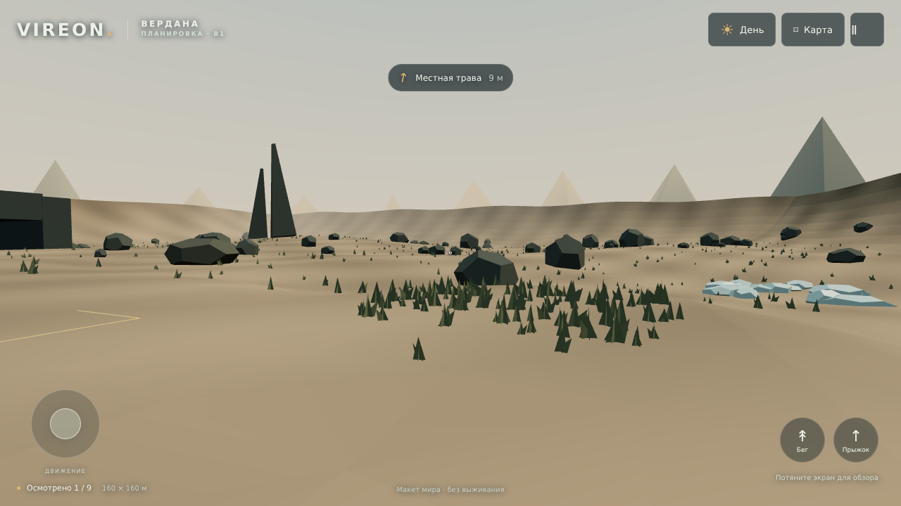
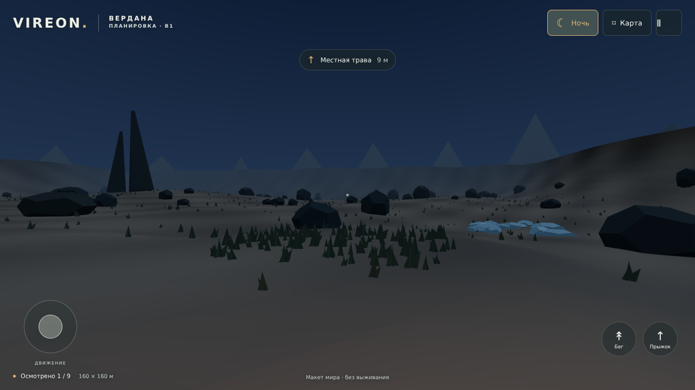
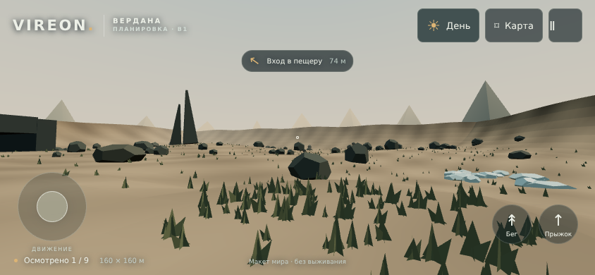

# Вердана B1 — исследуемая объёмная планировка

28.09.2026. Этап 2 после художественного пакета A1. Это работающая сцена Three.js с простыми объёмами и временными средствами осмотра; не окончательные модели, игровой HUD или готовая survival-игра.

## Запуск

**Без установки:** скачать [vireon-verdana-b1.html](../../preview/vireon-verdana-b1.html) через кнопку загрузки файла GitHub, затем открыть скачанный файл в браузере с WebGL2. Встроены код и стили; CDN и сервер для этой версии не нужны. Предпросмотр файла в файловом менеджере телефона может не запускать JavaScript — на телефоне надёжнее открыть сцену по HTTP через локальный сервер. Проверка file:// проведена в Chromium, не в Safari/iOS.

**Из исходников:** Node.js 22.12+.

```sh
npm ci
npm run dev
```

Открыть показанный Vite адрес. Для телефона в одной Wi-Fi-сети с компьютером — адрес компьютера с портом 5173; сервер по этой команде слушает сетевые интерфейсы. Если среда не разрешает перечисление интерфейсов, локальный вариант: `npx vite --host 127.0.0.1`. Постоянный публичный сайт не развёрнут.

```sh
npm test
npm run build
```

`dist/` — обычная статическая сборка. `preview/vireon-verdana-b1.html` — сохранённая в репозитории автономная сборка; генерируется также копия в `artifacts/`. Не редактировать сгенерированный HTML вручную: менять `src/`, затем пересобирать. Лицензия Three.js встроена в HTML; сторонние игровые модели/текстуры в сцену не включены.

## Управление

| Устройство / действие | Управление |
| --- | --- |
| Телефон: движение / обзор | Левый джойстик / свайп по свободной области сцены; можно одновременно |
| Компьютер: движение | WASD или стрелки |
| Компьютер: обзор | Перетаскивание мышью с зажатой кнопкой по сцене |
| Бег / прыжок | Shift или кнопка «Бег» / Space или кнопка «Прыжок» |
| Осмотреть место | Кнопка «Осмотреть» рядом с местом или E |
| Карта / пауза | M / Escape, либо кнопки сверху |
| День / ночь | Кнопка освещения сверху |
| Начать снова у капсулы | Через меню паузы; служебная функция макета |

Карта задаёт ориентир, но не перемещает игрока. Осмотр открывает карточку места и отмечает посещение. Все счётчики посещения живут только в текущем запуске. Поворот в портрет, скрытие страницы и потеря фокуса ставят прогулку на паузу; возврат требует явного продолжения. При отмене касания джойстик освобождается.

## Состав участка

Координаты из [брифа](../art/VERDANA_VISUAL_BRIEF.md) сохранены: капсула (40,40), площадка базы (58,44), трава (44,57), железо (67,65), медь (83,55), лёд (30,80), раздвоенная скала (102,104), пещера (115,72), сухая низина (100,132). Размер участка 160×160 м; будущая полная карта по-прежнему 768×768 м.

Камера после начала прогулки находится внутри капсулы на высоте глаз 1,6 м от ног. Проём можно пройти; карта и указатель помогают обойти участок. В пещере есть короткий тупиковый проход и потолок, а не полноценная шахта. Низина сухая, строительство базы обозначено угловыми метками 16×16 м. Дополнительные горы за границами участка — фон.

Числа контроллера взяты из GDD: ходьба 3,5 м/с, бег 5 м/с, импульс прыжка 4,5 м/с, гравитация 9 м/с², радиус тела 0,3 м, высота 1,8 м, шаг 0,5 м. Физика 20 Hz с интерполяцией камеры. Высота коллизии поверхности вычисляется по тем же треугольникам, что и видимая сетка; стены и крупные объекты используют упрощённые AABB с проверкой радиуса тела. Это промежуточный кинематический контроллер, не итоговая система воксельной физики.

## Важные границы реализации

- Геометрия создаётся кодом из примитивов. GLB-модели капсулы, скалы, травы и остальные 22 ассета пока не созданы.
- Капсула — прямоугольный объём для проверки двери/масштаба. Её окончательный силуэт должен следовать A1. Верхний и боковой свет, фактура и мелкие детали не являются окончательным художественным результатом.
- Интерфейс B1 — инструменты осмотра. Нет поддельных шкал кислорода/голода и нет обещания работающих систем выживания.
- Нет добычи, крафта, разрушения грунта, врагов, терраформирования, купола, ракет, звукового оформления или сохранения мира. Инвентарь/станки/строительство ещё не реализованы.
- Пауза во время карты и карточки — удобство **режима осмотра**, не изменение правил игрового планшета/инвентаря из §03 GDD. Служебный возврат к капсуле не добавляет телепортацию в игру.
- **Временное отличие от профиля Low GDD:** для проверки композиции участка камера имеет far=290 м, дневной туман 65–185 м, DPR≤1. Дальний фон и скала видны при осмотре. Это не готовый игровой профиль Low с дальностью 80 м; LOD/фоновые представления ориентиров и итоговые профили нужно реализовать перед проверкой производительности полной игры. Не выдавать этот макет за уже выполненную оптимизацию всей планеты.
- Диагностический p95 показывает фактическое время кадров данного браузера, без обрезки до максимального физического шага. Ограничение шага симуляции 250 мс отдельно; при тяжёлых кадрах макет замедляется, не ускоряет игрока.

## Проверка

`npm test`: шесть проверок контроллера и геометрии — совпадение высоты с сеткой, выход из капсулы, блокировка стены/диагональная скорость, потолок прыжка, проход пещеры туда-обратно, достижимость всех девяти областей без прыжков. Маршрут автоматически пройден контроллером за 141,6 симулированной секунды; это **не** замер темпа игрока или подтверждение цели 3–5 минут исследования.

Браузерная проверка:

```sh
npx playwright install chromium
npm run verify:browser
```

Скрипт сам запускает Vite на 127.0.0.1:5173 и закрывает браузер/сервер после проверки. Проверяет загрузку WebGL2, реальные действия UI, клавиатуру, обзор, два одновременных касания через CDP, отмену касания, карту без телепортации, паузу, поворот экрана и автономный HTML. В этой рабочей среде agent-browser недоступен из-за запрета служебного Unix-сокета; использован прямой Playwright. Chromium предоставлен отдельно как `@sparticuz/chromium` 153.0.0 через переменную `VIREON_CHROMIUM_MODULE`; это зависимость среды проверки, не игрового приложения.

В двух контрольных видах зафиксированы 31–34 вызова отрисовки и 22 190–22 226 треугольников. Это измерения конкретных кадров B1, не максимальная нагрузка будущего мира.

Отчёт: [browser-verification.json](B1/browser-verification.json). Снимки ниже — **реальный WebGL-рендер B1**, в отличие от генерированных художественных концептов A1. Проверенные окна 1280×720 и 844×390, портретная пауза 390×844. Работа на физическом телефоне, Safari/iOS, длительный нагрев и реальное время кадра на мобильном GPU **не проверены**. Программный Chromium не даёт основания обещать 30 FPS на телефоне.

### День



### Ночь



### Горизонтальный мобильный размер



## Следующий результат

Дать Малику пройти макет: проверить масштаб двери и скал, расстояния, читаемость льда/руд и удобство обзора. Исправить найденные проблемы планировки. Затем — три эталонные 3D-модели (капсула, скала, трава) по A1, остальные ассеты и итоговые макеты интерфейса. Числа экономики и рецепты в этом этапе не менялись.

Технические первичные справочники: [Three.js InstancedMesh](https://threejs.org/docs/pages/InstancedMesh.html), [BufferGeometry](https://threejs.org/docs/pages/BufferGeometry.html), [Pointer Events](https://developer.mozilla.org/en-US/docs/Web/API/Pointer_events). Они использованы для реализации; подтверждение поведения B1 — отдельные проверки выше.
