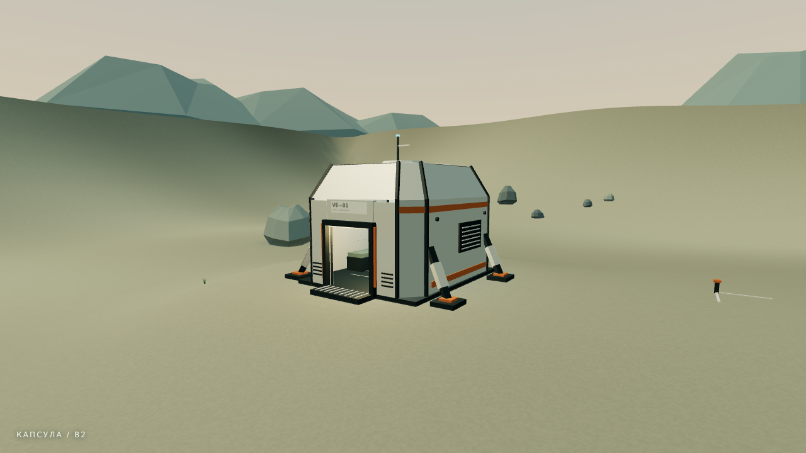
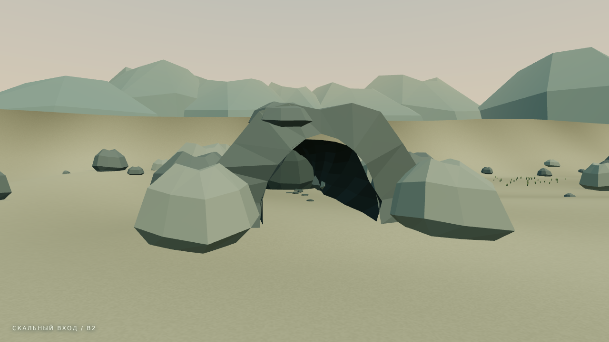
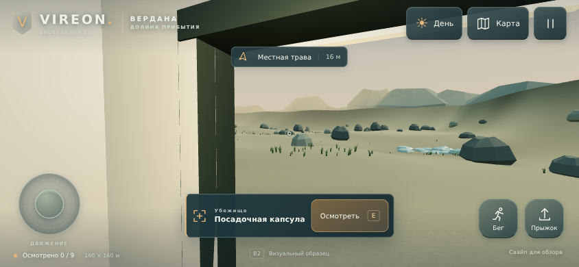

# Вердана B2 — модели, интерфейс и мобильный осмотр

29.09.2026. Продолжение B1 по пяти скриншотам и замечаниям Малика. Это **реальная сцена Three.js**, а не набор растровых концептов. Полные системы выживания ещё не подключены.

## Что изменилось

| Часть | Реализация B2 |
| --- | --- |
| Капсула | Восьмигранный корпус с плечевым сужением, силовые рёбра, оранжевые полосы, четыре опоры, порог с решёткой, вентиляционные панели, верхний люк, радиатор и антенна. Маркировка VE—01. |
| Интерьер | Койка, консоль с подсветкой, держатели баллонов, потолочные рёбра и светильники. Мебель имеет упрощённые коллизии. Консоль и баллоны — визуальные детали, не работающие системы. |
| Пещера | Неровная скальная арка, сплошной наружный массив, изогнутый внутренний свод, осыпь у входа и мелкие камни внутри. Короткий проход остаётся тупиковым; раскопок пока нет. Прямоугольные коллайдеры не используются как видимая модель. |
| Скалы и фон | Три варианта асимметричной слоистой геометрии, составной раздвоенный ориентир, широкие дальние массивы вместо одинаковых пирамид. |
| Трава | **244 пучка вместо 1 218** в B1: 204 в шести пятнах, ещё 40 одиночных. Количество уменьшено в 4,99 раза. Изогнутые листья с цветом у основания и на кончиках. Дверь, строительная площадка и проход пещеры остаются свободными. |
| Поверхность | Широкие цветовые полосы грунта, локальный цвет низины, мелкая повторяемая фактура, мягкие контактные тени под обычными камнями и капсулой. |
| Интерфейс | Компактная приборная панель, единые SVG-значки, объёмные состояния кнопок, новый джойстик, горизонтальная карточка осмотра, меню и карта. Показатели отладки скрыты по умолчанию. |
| Полный экран | Кнопка «На весь экран» в меню. Повторное нажатие возвращает обычный режим. Ошибка/отсутствие поддержки объясняются в меню; успешное включение не имитируется CSS. |

Расположение девяти мест, размер 160×160 м, скорости и правила GDD сохранены. Следующий механический этап не подменён декоративными шкалами кислорода или голода. Экономика B0 и каталог рецептов не менялись.

## Запустить

Автономная сборка: [vireon-verdana-b2.html](../../preview/vireon-verdana-b2.html). Скачайте файл; GitHub показывает исходник, а не выполняет HTML. На Android можно открыть через локальный HTTP-сервер, как предыдущую версию. Никаких CDN-зависимостей у автономного файла нет.

Из исходников:

```sh
npm ci
npm run dev
npm test
npm run build
```

`dist/` содержит сайт для Vercel; `preview/vireon-verdana-b2.html` и `artifacts/vireon-verdana-b2.html` генерируются из тех же исходников. Старый B1 сохранён для сравнения и больше не перезаписывается сборкой.

Управление: WASD/стрелки, перетаскивание мышью для обзора, Shift/Space, E для осмотра, M для карты, Esc для паузы. На телефоне — левый джойстик, свайп по сцене, кнопки бега и прыжка. Одновременные движение и обзор поддерживаются. Карта выбирает ориентир без телепортации.

**Полноэкранный режим:** начать прогулку → меню справа сверху → «На весь экран» → «Продолжить». Используется Fullscreen API с `navigationUI: 'hide'`. Конкретное скрытие интерфейса и поддержка зависят от браузера; CSS не может принудительно убрать адресную строку. Проверены вход, выход, отказ и отсутствие API в Chromium. iOS/Safari и физический телефон с B2 ещё не проверены.

## Модели и нагрузка

`src/geometry.ts` объединяет статические элементы по материалам; отдельный болт или панель не создаёт отдельный draw call. Трава — один InstancedMesh. Камни используют повторяемые формы; прозрачных текстур травы нет. Тени — небольшие локальные контактные текстуры, без динамических shadow maps. Фактура грунта и маркировка капсулы генерируются локально; внешних моделей, шрифтов и изображений нет.

B2 остаётся процедурной геометрией в TypeScript, **не комплектом GLB**. Форма усложнена непосредственно в игре. Отдельный экспорт ассетов в GLB возможен позже и не нужен для запуска этой версии.

DPR ограничен 1. Дальность камеры 290 м и туман 70–195 м сохранены для визуального осмотра; это временное отличие от будущего Low-профиля 80 м. Объединённая геометрия имеет грубое отсечение по материалу: подход подходит этому образцу, для полной планеты нужны пространственные чанки/LOD. Мелкие камни, опоры и декор не имеют точных треугольных коллизий; крупные препятствия используют AABB.

## Проверка

- Шесть проверок контроллера: высота рельефа, выход через дверь, стены и скорость, прыжок/потолок, пещера туда-обратно, все девять областей без прыжков.
- Двадцать браузерных проверок: загрузка, осмотр, движение/обзор, день/ночь, пауза, карта, мультитач/отмена, полный экран и его ошибки, размеры кнопок, портретная пауза, автономный запуск и отсутствие сетевых ресурсов, крупные планы и отсутствие ошибок.
- Размеры: 1280×720, 844×390, компактный 667×320 и портрет 390×844. Интерактивные кнопки в основном мобильном размере не меньше 48 CSS px. Карточка осмотра не перекрывает движение/действия в компактном размере.
- [Машинный отчёт](B2/browser-verification.json) содержит реальные числа конкретных кадров. Chromium в рабочей среде использует программную графику: его p95 нельзя выдавать за мобильный FPS.
- Скриншоты пользователя B1 показывали около 16,8 мс p95 на его устройстве. Это наблюдение для B1, **не измерение B2** и не общий результат для телефонов.

Повторить браузерные проверки: `npx playwright install chromium`, затем `npm run verify:browser`. Скрипт запускает собственный Vite, закрывает процессы в `finally`. В данной среде использован прямой Playwright: agent-browser не смог создать служебный Unix-сокет. Отдельный Chromium предоставляется через `VIREON_CHROMIUM_MODULE`; эта зависимость не входит в игру.

`tools/scene-review.html` — отдельный рабочий стенд для фиксированных крупных планов той же сцены. Он не входит в `dist/`, не добавляет в игру перемещение к произвольным координатам. Снимки моделей ниже сделаны на этом стенде; мобильный кадр — из обычной игры.







Дополнительные реальные виды: [интерьер](B2/interior.png), [ночная капсула](B2/night.png), [трава](B2/grass.png), [меню](B2/menu.png). Финальная production-сборка дополнительно проверена после последних правок фактуры и моделей: загрузка, полный экран и шесть контрольных видов без ошибок.

## Публикация

Пользователь **явно разрешил** GitHub и Vercel. Исходники и готовая автономная сборка сохраняются в `Malikk-Sh/Verion-game`. Подготовлены `vercel.json` (Vite → dist) и `.vercelignore`, исключающий документы и проверочные страницы из загрузки.

На момент этого отчёта **Vercel не развёрнут**: подключённый `deploy_to_vercel` возвращает `Tool deploy_to_vercel not found`; Vercel CLI 61.0.0 не авторизован; попытка штатного временного режима ответила `Temporary deployments aren't available for this attempt`. Login-flow остановлен, доступ не обходился. Следующий шаг — авторизация CLI либо, после разрешения пользователя на смену способа, импорт GitHub-проекта через браузер Vercel. Не утверждать наличие публичного URL до успешной публикации и проверки.

В кабинете Vercel: Import Git Repository → `Malikk-Sh/Verion-game` → framework Vite, root `./`, build `npm run build`, output `dist`. Секреты/база данных не нужны. Существующие настройки защиты проектов не изменять.

Первичные API-источники: [Three.js BufferGeometryUtils](https://threejs.org/docs/pages/module-BufferGeometryUtils.html), [InstancedMesh](https://threejs.org/docs/pages/InstancedMesh.html), [Fullscreen request](https://developer.mozilla.org/en-US/docs/Web/API/Element/requestFullscreen), [fullscreenEnabled](https://developer.mozilla.org/en-US/docs/Web/API/Document/fullscreenEnabled).
