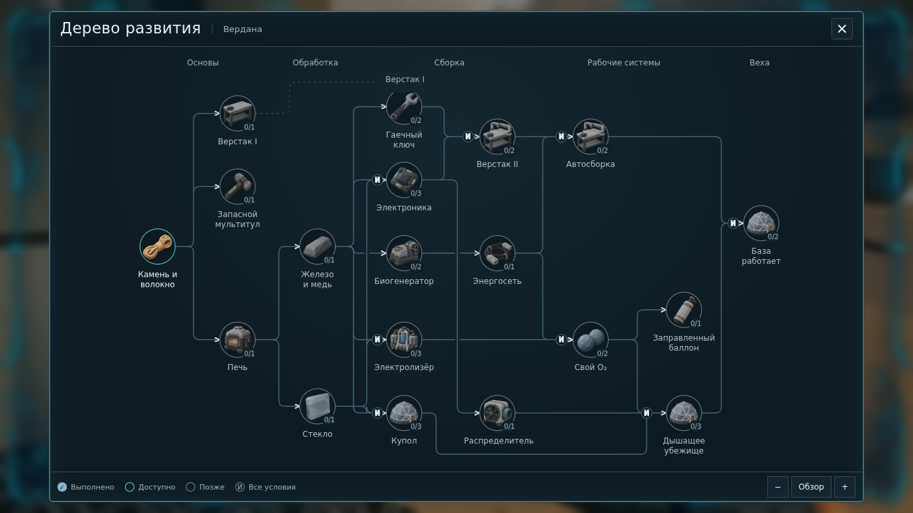
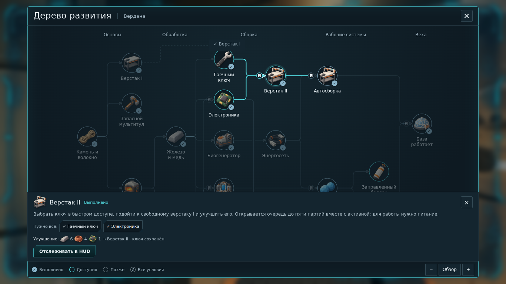
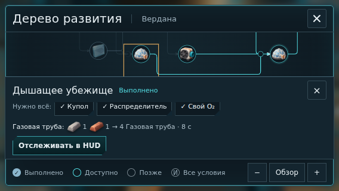

# Вердана S2.5 — дерево развития

> Актуализация S2.6: ресурсные цены, закрепление цели и высокая карточка заменены компактным попапом. Текущие правила и кадры: [VERDANA_S26.md](VERDANA_S26.md). Описания прежней карточки ниже относятся к S2.5.

8 октября 2026. `stage2-survival` / [PR #4](https://github.com/Malikk-Sh/Verion-game/pull/4). [Игровое превью](https://verion-game-git-stage2-survival-malikk-shs-projects.vercel.app/).

## Что реализовано

Квестбук открывается клавишей J, кнопкой задачи в HUD и из паузы. На карте слева направо — 19 вех существующих систем, фиксированные координаты, ортогональные маршруты и хабы обязательных условий. Контекст верстака I общий для сборки компонентов. Только выбор узла открывает нижнюю карточку: действие, непосредственные условия и текущая стоимость рецептов со спрайтами. Выбор не перестраивает карту; несвязанные ветви приглушаются. Количество выполненных условий и галочки дополняют цвет.

Поле карты поддерживает обычную прокрутку в двух направлениях и масштаб 40–150%. На малом масштабе «Обзор» показывает структуру без мелких подписей; карточка остаётся в обычном масштабе интерфейса. На коротком экране её содержимое прокручивается отдельно от кнопок закрытия и отслеживания. Минимум всех кнопок — 32×32 CSS px. Чтение останавливает игровые часы. Escape закрывает карточку, затем книгу; вход из паузы возвращает в паузу.

Игрок сам выбирает цель HUD. Завершение не переключает её на следующую. Компас сохраняет выбранный ориентир. Нет наград, новых запретов рецептов или обязательного маршрута. Состояние «Позже» объясняет зависимости карты; реальное достижение засчитывается и до выполнения её рекомендуемых предшественников.

| Направление | Вехи | Проверяемый результат |
| --- | --- | --- |
| Снабжение | Камень и волокно, запасной мультитул | Материалы получены; изготовлен дополнительный инструмент, а не выдан стартовый |
| Обработка | Верстак I, печь, железо и медь, стекло | Станции установлены; оба металла и стекло получены |
| Компоненты | Гаечный ключ, электроника | Предметы изготовлены; необходимые материалы остаются доказуемыми после их расхода |
| Энергия | Биогенератор, энергосеть | Корпус установлен; конечная энергия реально выделена потребителю |
| Автоматизация | Верстак II, автосборка | Улучшение существует; хотя бы один оплаченный результат готов вдали от игрока |
| Кислород | Электролизёр, свой O₂, заправленный баллон | Корпус установлен; электролиз завершён; своя станция реально передала газ в установленный баллон |
| Убежище | Купол, распределитель, дышащее убежище | Корпуса установлены; герметичность, газ, чистота и температура одновременно пригодны |
| Общая веха | База работает | После первой автономной партии верстак II реально работает при пригодном воздухе в куполе |

## Модель прогресса и совместимость

`src/game/questCatalog.ts` хранит семантику вех, координаты и маршруты; стоимость остаётся в `RECIPE_BY_ID` и `WORKBENCH_UPGRADE`. Все 21 текущие рецепты и улучшение включены в карточки. `questFacts.ts` ограничивает допустимые факты, `quests.ts` закрепляет достижения. `production.ts` пишет факты успешного результата, питания, заправки и одновременной работы. Блокировка выхода и отмена не выдают успех. Уже выполненные цели сохраняются при последующем расходе, смерти, отключении питания и проломе.

`stateVersion: 5` сохраняет `progress.quests` вместе с существующими страницами IndexedDB и экспортом. Импорт проверяет ID, количество, дубликаты и выбранную цель. Миграция v4 сохраняет базу, уровни, очередь, оплаченный WIP, газ и топливо, добавляя пустую историю. Прогресс старого мира восстанавливается по сохранившимся предметам/буферам, добытым участкам и установленным корпусам. Предмет доказывает его необходимые входы; стартовый мультитул, пульпа и полный баллон не доказывают их изготовление. Исчезнувшую историю нельзя восстановить: например, автономную партию и заправку старого мира нужно выполнить ещё раз.

## Проверка

`npm test`: 108 проверок, включая 13 новых проверок графа, реальных фактов, ложных успехов, сохранения достижений, одновременной работы и миграции. Все 11 сценариев `npm run verify:quests` прошли: прогон проверяет реальный игровой WebGL, оплаченный ручной крафт до открытия книги, выбор HUD, запись и чтение IndexedDB, работающий верстак II и купол, карточки и размеры 1366×768, 844×390, 667×320 и 568×320. Скриншоты и JSON отчёт записываются в `artifacts/s25-quest-*`; CI сохраняет их как артефакты.

Прогон использует ограниченные валидные запасы и расположенные корпуса для воспроизводимой проверки событий. Это проверка программной корректности в Chromium / SwiftShader; она не подтверждает темп прохождения человеком или FPS физического телефона. На всей карте только работающие системы S2, без обещаний ещё не реализованных глав.

## Игровые кадры

