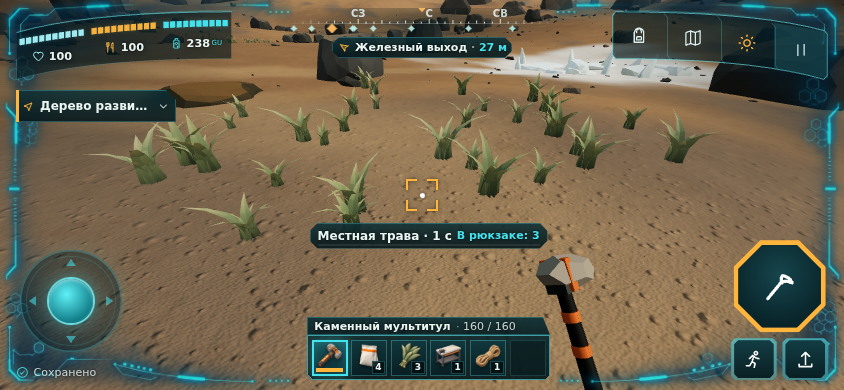
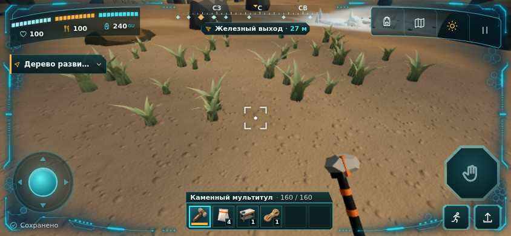
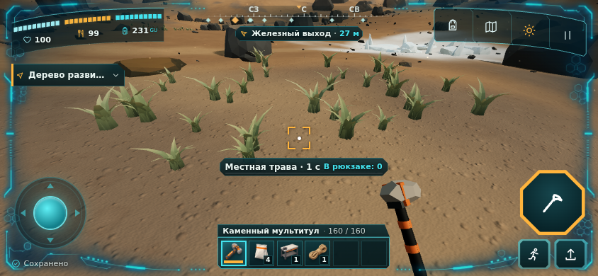
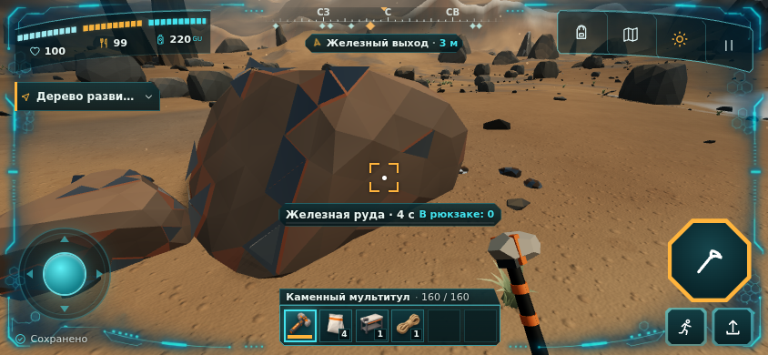
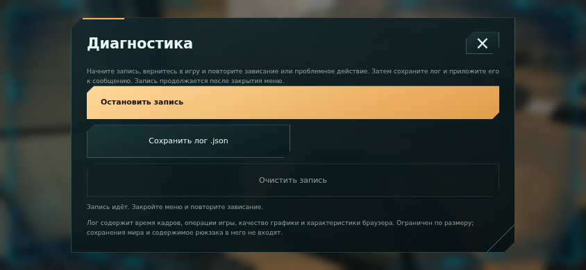
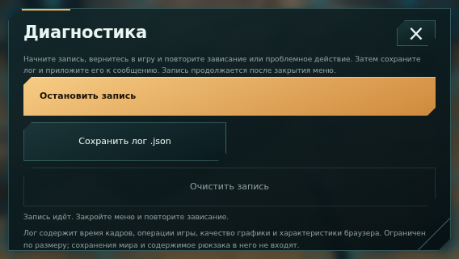

# S2.7 — фризы, освещение и диагностика устройства

Работа в `stage2-survival`, PR #4; `main` не объединяется, автономный HTML не обновляется. Игровые правила и состояние v6 сохранены. Эти изменения относятся к производительности и отображению; результаты SwiftShader не подтверждают FPS телефона.

## Найденные причины и изменения

| Место | Наблюдение | Изменение |
| --- | --- | --- |
| Тень рельефа | Пакет из 10 строк занимал 11–85 мс; лучи за границами мира повторно вызывали шумовую генерацию высоты | Используется уже рассчитанная сетка 4 м. Расчёт возобновляется внутри строки с целевым бюджетом 2 мс. При загрузке/смене времени нет полного синхронного bake; готовая текстура плавно подмешивается |
| Детальный рельеф | Первый кадр мог строить до 24 блоков по четыре меша; затем целый блок за кадр | Сборка по строкам с бюджетом 2 мс, максимум один законченный меш за вызов. Coarse заменяется только после готовности всех четырёх частей. LOD пересматривается после движения на 2 м; невидимый кэш ограничен 20/32 блоками и освобождается через dispose |
| Отражения | Новый PMREMGenerator и захват/фильтрация окружения в игре. Даже повторное использование генератора оставило замер около 604 мс в программном GPU | Четыре карты (день/ночь, 64/128) готовятся при загрузке. В игровом цикле захватов PMREM нет. На переходе день/ночь интенсивность отражений плавно гаснет, палитра меняется при нулевой интенсивности и возвращается |
| Камни | Общий видимый меш `rock` содержит 112 568 треугольников, включая части за камерой | Окружение группируется по материалу и ячейке 40 м. Камни, руда, лёд, скалы и пещера получают отдельные bounding volumes; детали капсулы продолжают объединяться по материалу. Геометрия, цвета и коллизии не изменяются |
| Графические программы | Первое использование и новые варианты материалов дают длинные задержки драйвера | До готовности стартовой кнопки используются compileAsync и прогрев моделей инструмента/ключа с реальной отрисовкой. Явная первоначальная загрузка остаётся отдельным этапом |
| Крафт и другие меню | Сцена продолжала отрисовываться с полной частотой; открытие крафта дважды строило его DOM | Открытие строит панель один раз. Производство, выживание и UI продолжают работать на каждом RAF; только 3D-представление ограничено: Low 30 FPS в игре, 10 в живом меню; другие режимы 15 в живом меню; пауза 4. Тяжёлое обслуживание рельефа/тени не запускается в меню |
| Low | DPR 1, мелкая галька и тяжёлое обслуживание света сохранялись | DPR 0,75 только для 3D; HUD остаётся чётким в CSS-пикселях. Нет динамических теней, пыли и декоративной гальки. Добываемые материалы и трава остаются |
| Показатели | getState/панель показателей запрашивали WebGL VERSION при каждом обновлении и копировали игровое состояние | GPU-сведения читаются один раз при загрузке. Показатели используют готовые счётчики; вызовы/треугольники учитывают мир и модель в руке |
| Сохранения | Дублирующий запрос при открытии порта без активной заправки; неизвестная причина задержки до записи | Убран пустой запрос. Snapshot, encode и асинхронный commit-wall измеряются отдельно. Strict-транзакции, SHA, ревизии, lease, WIP и политика автосохранения сохранены |

Бюджет 2 мс — целевой, а не жёсткая гарантия: завершение меша, JIT, GC и драйвер могут превысить его. В локальном CPU-прогоне shade-срезы имели p95 2,5 мс / максимум 5,9 мс вместо пакетов до 85 мс. В сценарии живой игры максимум shade 4 мс, terrain 9 мс, обновления готового окружения 0,2 мс; построение крафта — до 3 мс, encode — до 0,3 мс. Это результаты среды разработки, не телефона.

Синтетическая CPU-проверка связанной базы из 64 станций: production p95 0,32 мс, quest refresh p95 0,27 мс, encode максимум 11,8 мс на холодном прогоне. Производство и сохранение небольшой базы не оказались главным источником воспроизведённых фризов. Диагностика оставлена для проверки крупного сохранения и реального устройства.

## Освещение и тени

- Охват тени привязан к положению персонажа и высоте земли; поворот, камера в прыжке и bob больше не перемещают его. Координаты округляются в пространстве света. Карта обновляется при изменении света/положения/геометрии.
- Вместо PCFSoft используется PCF с небольшим радиусом; уменьшен depth bias, увеличен normal bias. Мелкая трава не отбрасывает карту тени: её прежняя depth-геометрия не повторяла ветер из цветового шейдера.
- Near plane увеличен с 0,07 до 0,15 м. У грунта небольшой polygon offset, более спокойная normal map с анизотропной фильтрацией и roughness 1. Это снижает конфликт глубины и мелкие блики на пересечениях поверхностей.
- Low ранее отключал динамические тени, поэтому белое мерцание в нём нельзя объяснить только настройкой shadow bias. В данном программном GPU характерные белые вспышки у основания однозначно не воспроизвелись. Изменения глубины/поверхности и стабильных отражений проверены, но окончательная проверка этого симптома нужна на устройстве пользователя.

Проверка сравнивает **сырые пиксели canvas после реального render**, исключая анимации DOM. Остановленные кадры идентичны в Low/Standard/High. Поворот на той же позиции при остановленных часах сохраняет shadow target. Это подтверждает стабильность данной сцены/драйвера; не заменяет видеозапись движения на телефоне.

## Как снять лог на устройстве

1. Пауза → Настройки → **Диагностика зависаний** → **Начать новую запись**.
2. Закрыть меню, поиграть и повторить зависание/крафт. Запись продолжает идти в фоне.
3. Вернуться в диагностику, остановить запись и нажать **Сохранить лог .json**. Приложить файл и, для мерцания, короткую запись экрана к сообщению.

Ничего не отправляется автоматически. Лог не включает файл мира, рюкзак, имя мира или токен записи. В нём есть версия/имя JS-ассета, браузер и GPU, размер/DPR, счётчики геометрии/текстур/станций, RAF-интервалы, этапы работы, input delay, ошибки/context loss, longtask/LoAF/Event Timing при поддержке браузером. Список видимых мешей по материалу позволяет найти дорогую геометрию.

Хранение ограничено: последние 600 кадров для p95, до 600 редких образцов (не чаще одного за 500 мс), 240 медленных кадров и 240 событий. Итоги этапов накапливаются без копирования мира и записей в IndexedDB на каждом кадре. Stop прекращает сбор, Clear удаляет данные; новая запись начинает новый набор. После перезагрузки страницы несохранённый лог исчезает.

`RAF gap` — интервал между callback, не длительность работы GPU. `render-submit` — работа JS/драйвера до возврата render, не асинхронное исполнение GPU. `save:commit-wall` включает ожидание IndexedDB. Длинный интервал при коротких этапах оставляет причину вне измеренной JS-работы; это основание проверить GPU/композитор/браузер, а не доказательство вины GPU. Явную загрузку, скрытую вкладку, смену качества и паузу анализируют отдельно.

Локальный разбор: `node tools/analyze_performance.mjs path/to/vireon-performance.json`. Повтор CPU-профилирования — `npm run profile:runtime -- sample`; на физическом устройстве используется запись через интерфейс игры.

## Проверки и ограничения

126 unit-проверок; TypeScript и Vite build; `validate_design.py`. Новые проверки защищают ограниченность записи, остановку/очистку, возобновление bake внутри строки, точную поверхность/атомарную смену LOD, ограничение кэша при остановке после путешествия и отсечение дальних мешей без изменения их геометрии.

`verify:performance` — 8 сценариев с исходным RAF: реальные кнопки и скачивание JSON, конечный ручной крафт, стабильная проекция/сырые пиксели, три качества, экран 568×320, Stop/Clear и отсутствие ошибок. Suite добавлен шестой независимой задачей CI; итоговый browser gate требует все шесть.

Контрольный кадр руды на Low: 193 657 треугольников мира / 130 видимых мешей; в финальном кадре отдельного маршрутного прогона — 194 500 треугольников и 131 вызов с моделью в руке. Бюджет B0 250k/150 проходит в этих видах, не гарантируется для любого ракурса большой базы.

Один сравнительный прогон Chromium/SwiftShader, 844×390, без искусственной задержки RAF:

| Сценарий | p95 RAF до, мс | p95 RAF после, мс | Longtask до / после |
| --- | ---: | ---: | ---: |
| Крафт верстака из конечного запаса | 1050 | 683 | 6 / 0 |
| Трава | 933 | 583 | 2 / 0 |
| Ходьба | 833 | 367 | 0 / 0 |

Это медленный программный GPU: **цель 30 FPS здесь не достигнута**, проценты нельзя переносить на телефон. Начальная генерация мира/драйверные прогревы остаются затратными и отделены от обычной игры; одна первая задержка драйвера также видна в профиле до добавления фактического прогрева модели в руке. После него проверена игровая регрессия. Контроль на телефоне по методике QA (10 минут после прогрева и длинная сессия на нагрев) не выполнен. Полные числа одного прогона — [VERDANA_S27_MEASUREMENTS.json](VERDANA_S27_MEASUREMENTS.json). Vite сохраняет предупреждение о размере JS (~776 kB до gzip).

Регрессии крафта/производства и финальный CI фиксируются в PR #4. Скриншоты ниже — реальные кадры игры, без генерации и ретуши. Видимый HUD может немного различаться из-за разных конечных тестовых запасов и активного времени.

## Кадры

До исправлений, Low:

После, Low:

Standard:

High:

Запись диагностики и компактный экран:

## Первичные источники API

Three.js 0.180.0: установленный `PMREMGenerator.js`, `WebGLRenderer.js`, `WebGLShadowMap.js`; [LightShadow](https://threejs.org/docs/pages/LightShadow.html). [Chrome Long Animation Frames](https://developer.chrome.com/docs/web-platform/long-animation-frames) — атрибуция длинных кадров и проверка поддержки. Диагностика не зависит от наличия LoAF/Event Timing.
